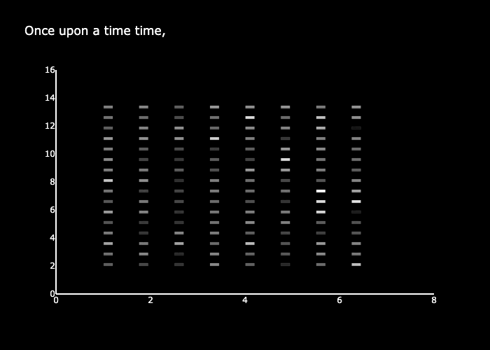

# tiny-stories-interp
learning about mech interp. on the tiny stories model

## easy vizualization

to get started i just wanted to do an easy yet cool looking visualziation of a transformer working
took less than 2 hours

the gif shows the activation in the last column of the attention matrix in each head of the tiny stories model as it autocompletes the story.
the model is a 8 layer model with 16 heads in each layer.

text was seeded "Once upon a time"
